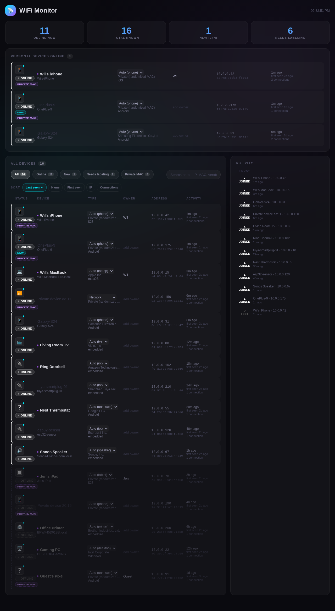

# WiFi Proximity Notifier

A daemon that watches your local network and tells you when devices show up or leave. Sends desktop notifications with sound and runs a live dashboard — an advanced version of your router's device list, with consistent labeling, OS/manufacturer identification, and activity history.




## How it works

```
  ip monitor neigh (live) ───────┐
  arp-scan (every 10s)  ─────────┼──> Process ──> Identity engine ──> Notify + Dashboard
  ip neigh (ARP table) ──────────┘       │
                                         ├── New device? → notification + chirp
  nmap (every 30s) ──────────────────────┤── Device gone? → arping probes → confirm → notify
  mDNS / TLS / HTTP / NetBIOS probes ────┘── Evidence → canonical labels → SQLite DB
```

Connect detection is mostly passive: a persistent `ip monitor neigh` subprocess streams kernel ARP table transitions live, so a new or returning device is picked up in near real time instead of waiting for a poll. A 10-second poll (`arp-scan` + the kernel ARP table) still runs as a fallback/reconcile pass. When a device drops out of the ARP table, rapid `arping` probes confirm it's actually gone before sending a disconnect notification — this avoids false alarms for sleeping phones, which ignore ICMP pings but still respond to ARP.

## Device identity engine

Every device is resolved to four canonical fields, each with a confidence score and provenance (which evidence source asserted it):

- **display name** — best human name (mDNS advertised name, hostname, NetBIOS, or a vendor-based composite)
- **device type** — one of: phone, tablet, laptop, desktop, tv, console, iot, network, printer, speaker, watch, camera, unknown
- **OS guess** — iOS, Android, Windows, macOS, Linux, tvOS, or embedded
- **manufacturer** — OUI registry vendor, or evidence-derived for randomized MACs

Evidence sources, strongest first: your manual edits > mDNS services / TLS certs / HTTP banners > mDNS/NetBIOS/DNS hostnames > OUI vendor inference > legacy free-text guesses. Resolution is deterministic — the same evidence always produces the same labels, so names never flip-flop between rescans. Names, types, and owners you set by hand are never overwritten by any automatic process.

Randomized (private) MACs get flagged with a badge and labeled "Private device xx:xx" unless mDNS or a hostname gives them a stable identity. When the ruleset improves (`identity.ENGINE_VERSION` bump), every stored device is re-resolved at startup from its accumulated evidence — no history is lost.

See `plans/device-identity-engine.md` for the design.

## Install

Tested on Arch Linux. Should work on anything with systemd.

Needs Python 3.10+, `nmap`, and `arp-scan`.

### Quick start

```bash
git clone https://github.com/Tsangares/wifi-proximity-notifier.git
cd wifi-proximity-notifier
chmod +x install.sh
./install.sh
```

### Manual setup

```bash
sudo pacman -S --needed nmap arp-scan

python3 -m venv venv
source venv/bin/activate
pip install -r requirements.txt

# Run manually (needs root for arp-scan, nmap, arping, sysctl)
sudo ./venv/bin/python3 app.py

# Or install as a service
sudo ln -sf "$(pwd)/wifi-notifier.service" /etc/systemd/system/
sudo systemctl daemon-reload
sudo systemctl enable --now wifi-notifier
```

### Passwordless restart (optional)

Let your user restart the service without a sudo password:

```bash
echo 'YOUR_USER ALL=(ALL) NOPASSWD: /usr/bin/systemctl restart wifi-notifier
YOUR_USER ALL=(ALL) NOPASSWD: /usr/bin/systemctl stop wifi-notifier
YOUR_USER ALL=(ALL) NOPASSWD: /usr/bin/systemctl start wifi-notifier
YOUR_USER ALL=(ALL) NOPASSWD: /usr/bin/systemctl status wifi-notifier' | sudo tee /etc/sudoers.d/wifi-notifier
```

## Usage

```bash
sudo systemctl start wifi-notifier
sudo systemctl stop wifi-notifier
sudo systemctl restart wifi-notifier

# View logs
journalctl -u wifi-notifier -f

# Debug mode (verbose logging)
sudo ./venv/bin/python3 app.py --debug

# Scanner only, no web UI
sudo ./venv/bin/python3 app.py --no-dashboard

# Demo mode — fake devices, separate mock.db, no root needed
python3 app.py --mock
```

## Dashboard

Open `http://localhost:5555`.

A router-style device list: every device shows its type icon, name, ONLINE/OFFLINE state, IP, MAC (with a PRIVATE MAC badge for randomized addresses), manufacturer, OS, first/last seen, and connection count. Filter chips (Online / New / Needs labeling / Private MAC), free-text search, and sorting. Click a name to rename it; set a canonical type or an owner inline — your edits are sacred and survive every rescan. The "Needs labeling" view queues up devices you haven't named yet. Clicking a device's type icon shows *why* it was identified that way (per-field source and confidence). The activity timeline shows connects and disconnects grouped by day.

The UI uses text labels (ONLINE/OFFLINE, JOINED/LEFT), solid vs dashed borders, distinct shapes, and brightness differences instead of relying on color alone. It refreshes every 5 seconds without page flicker (DOM diffing) and collapses to stacked cards on a phone screen.

### Access from other devices (LAN / Tailscale)

The dashboard binds to `0.0.0.0` by default, so it's reachable from your home LAN and, if the machine runs Tailscale, from your tailnet:

- from a phone on the tailnet with MagicDNS: `http://taxi:5555`
- or by Tailscale IP: `http://100.83.247.91:5555`

Tradeoff: binding all interfaces means anyone on your LAN can view the device list (it exposes MACs, IPs, and names — but no control over your network). There is no auth yet; `dashboard.py` has a single `before_request` hook where a bearer-token check can be added later. To restrict access, set `WIFI_NOTIFIER_HOST=127.0.0.1` (or pass `--host`) in the service environment.

## API

| Endpoint | Method | Description |
|----------|--------|-------------|
| `/api/devices` | GET | `{"devices": [...]}` — all devices with resolved identity, confidence/provenance, connection counts |
| `/api/devices/<mac>/rename` | POST | Rename a device `{"name": "My Phone"}` |
| `/api/devices/<mac>/update` | POST | Set user fields `{"name": ..., "type": ..., "owner": ...}` (type must be canonical, or `""` to clear the override) |
| `/api/devices/<mac>/fingerprint` | GET | Raw deep-probe evidence for a device |
| `/api/devices/<mac>/reprobe` | POST | Queue a device for re-fingerprinting |
| `/api/activity?limit=50` | GET | Recent activity log |
| `/api/meta` | GET | Canonical device types and OS values |

## Tuning

Edit the timing constants at the top of `scanner.py`:

```python
FAST_SCAN_INTERVAL = 10      # seconds between fallback/reconcile ARP sweeps (connect detection is mostly passive)
DETAIL_SCAN_INTERVAL = 30    # seconds between nmap hostname sweeps
DISCONNECT_PROBE_COUNT = 5   # failed arping probes before declaring gone
DISCONNECT_PROBE_SLEEP = 0.3 # seconds between probes
RECONNECT_GRACE = 90         # suppress re-notification if gone < this long
```

Dashboard bind address/port: `--host`/`--port` flags or `WIFI_NOTIFIER_HOST`/`WIFI_NOTIFIER_PORT` env vars.

## Mock mode

`python3 app.py --mock` seeds a **separate** database (`mock.db` — it never touches your real device history) with 16 fake devices, runs the identity engine over them, and starts the dashboard without scanning. No root needed. Useful for trying out the UI or regenerating the screenshots:

```bash
python3 app.py --mock --port 5556 &
python3 ~/.claude/skills/screenshot/capture.py \
    --url http://localhost:5556 \
    --output docs/dashboard.png \
    --width 1280 --height 1200 \
    --wait-selector ".device-row" \
    --wait-seconds 3 \
    --full-page
kill %1
```

## Project layout

```
app.py              Entry point. Identity backfill, scanner thread + Flask dashboard.
scanner.py          Scan loop, state tracking, disconnect detection.
net.py              Network tool wrappers (arp-scan, nmap, arping, ip neigh, ip monitor).
fingerprint.py      Background device probing (TLS certs, HTTP banners, mDNS, NetBIOS).
identity.py         Pure identity-resolution engine (evidence → canonical labels).
resolver.py         Glue: builds evidence from DB rows, persists resolutions, backfill.
device_db.py        SQLite database (~/.local/share/wifi-notifier/devices.db).
manufacturer.py     MAC vendor lookup (OUI) and randomized-MAC detection.
notifier.py         Desktop notifications via gdbus + sound via paplay.
dashboard.py        Flask routes.
mock_data.py        Fake device data for --mock mode (separate mock.db).
templates/          Dashboard HTML.
static/             Connect/disconnect sound files.
plans/              Design docs.
```

### bandwidth_monitor.py — separate tool, not part of the daemon

`bandwidth_monitor.py` is a standalone script, unrelated to `app.py`/`scanner.py`. It's meant to run on a Raspberry Pi named `nes`, not on this laptop: it ARP-spoofs the gateway to route LAN traffic through the Pi and exposes per-device bandwidth stats over HTTP on port 5556. It isn't started by `app.py`, isn't installed by `install.sh`, and doesn't share any code with the notifier. See the header comment in the file for usage.

## Tests

```bash
source venv/bin/activate
python3 -m unittest discover -s tests -v
```

Covers the `ip monitor neigh` line parser and subprocess-restart behavior, an end-to-end check of the passive-connect path against a throwaway SQLite DB, and the identity engine (evidence fusion, priority ordering, user-override protection, determinism/idempotence, private-MAC handling, DB-row evidence building) — all offline, no root or live network needed.

## Data

Device data lives in `~/.local/share/wifi-notifier/devices.db` (SQLite). It contains MAC addresses, IPs, and device names. This file is gitignored. Mock mode uses `mock.db` in the same directory; `WIFI_NOTIFIER_DB` overrides the path. Schema migrations are additive — upgrading never discards accumulated history, and identity re-resolution keeps all stored evidence and user edits.
